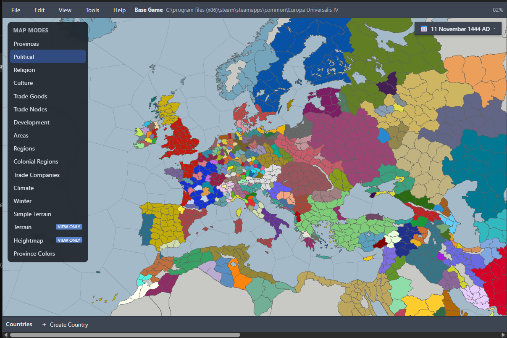

# EU Toolkit

**[⬇ Download here](https://github.com/lnxnb/eu-toolkit/releases/latest/download/eu-toolkit.exe)** — portable exe, no install needed ([all releases](https://github.com/lnxnb/eu-toolkit/releases))

A desktop editor for Europa Universalis IV mods. Point it at your EU4 install, pick a mod folder if you have one, and you get the game's world map — political, religion, culture, trade goods, trade nodes, development, areas and regions, climate — with the data behind it editable: provinces, countries, rulers, diplomacy and wars, estates, rebels, technology and units, missions, events, decisions, government reforms, trade companies, the HRE, localisation, defines.

Click a province to edit it, or paint religion and culture straight onto the map. Changes collect in a pending queue you can review, undo, and redo before anything is written to disk.

Total conversions work. Reads layer your mod over the base game the way EU4 does, `replace_path` included, so Anbennar and the like open without special handling — and keys the toolkit doesn't model are left alone rather than dropped.

Any date works, not just 1444 — the map and editors re-derive the world at whatever date you pick.

Also in there: project-wide search, a mod-vs-vanilla diff browser, a validation dashboard, and export & launch.

## Requirements

**To run the released exe:**

- Windows 10 or 11 (64-bit)
- A Europa Universalis IV installation
- 8 GB RAM recommended — the world map is decoded and rendered in memory

**To build from source, additionally:**

- [Node.js](https://nodejs.org/) 20 or newer
- [Rust](https://rustup.rs/) stable toolchain

## Running

Double-click **`run.bat`** (or run it from a terminal). On first run it installs npm dependencies, then builds and starts the app — the initial Rust compile takes a few minutes; later runs are fast. It runs in "stable mode": the running instance is never rebuilt or hot-reloaded out from under you — re-run `run.bat` to pick up source changes.

For development with hot reload instead, use `npm run tauri dev`.

## Building

**`build.bat`** produces a portable, optimized executable at `dist\eu-toolkit.exe`. No installer needed — settings live in `%APPDATA%\com.eutoolkit.app`.

Built with [Tauri 2](https://tauri.app/) (Rust) and [SvelteKit](https://svelte.dev/) (Svelte 5, TypeScript).

## License

[MIT](LICENSE)

## AI disclosure

Generative AI tools were used in the creation of this project, including for writing code, tests, and documentation. All of it was directed, reviewed, and tested by a human before release. If you find a bug or something that looks wrong, please open an issue or a pull request.
